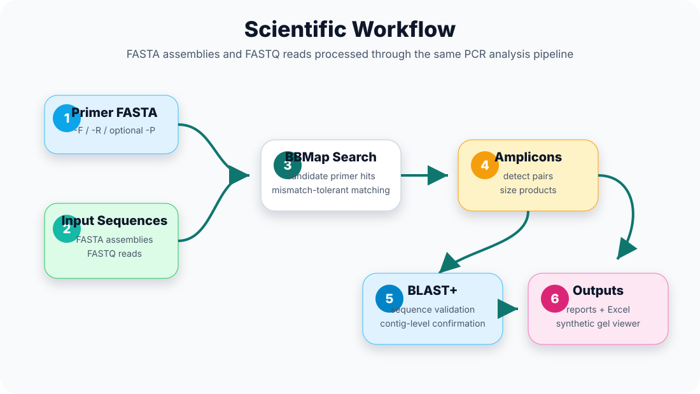
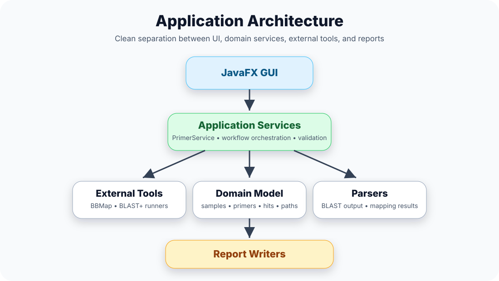
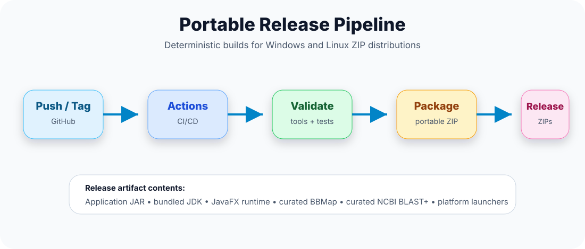

# insilicoPCR

<p style="text-align: center;">
  
</p>

<p style="text-align: center;">
  <strong>Modern cross-platform in silico PCR analysis for genome assemblies</strong>
</p>

<p style="text-align: center;">
  <a href="../../actions"></a>
  <a href="../../releases"></a>
  
  
  
  
</p>

---

## Table of Contents

- [Overview](#overview)
- [Why insilicoPCR?](#why-insilicopcr)
- [Features](#features)
- [Screenshots](#screenshots)
- [Scientific Workflow](#scientific-workflow)
- [Architecture](#architecture)
- [Performance and Modernization](#performance-and-modernization)
- [Installation](#installation)
- [Building From Source](#building-from-source)
- [Portable Releases](#portable-releases)
- [Runtime Layout](#runtime-layout)
- [Repository Structure](#repository-structure)
- [Documentation](#documentation)
- [CI/CD](#cicd)
- [Roadmap](#roadmap)
- [Third-Party Software](#third-party-software)
- [Citation](#citation)
- [License](#license)

---

## Overview

**insilicoPCR** is a modern JavaFX desktop application for performing **in silico PCR** against assembled genomes using **BBMap** and **NCBI BLAST+**.

It is designed for researchers, diagnostic laboratories, and surveillance programs that need a reproducible workflow for primer validation, multiplex analysis, amplicon detection, and report generation.

Unlike ad hoc command-line workflows, insilicoPCR provides an integrated desktop experience while still packaging the underlying scientific tools in a deterministic, portable runtime.

---

## Why insilicoPCR?

insilicoPCR combines BBMap and BLAST+ into a reproducible desktop workflow, eliminating manual command-line processing while producing structured, reviewable reports.

It is especially useful when users need to:

- screen many assemblies against one or more primer sets;
- validate predicted amplicons;
- support multiplex PCR workflows;
- generate Excel reports for downstream review;
- run the same workflow on Windows and Linux without installing Java, BBMap, or BLAST+ separately.

---

## Features

| Feature | Status |
|---|:---:|
| Primer pair analysis | ✅ |
| Multiplex PCR workflows | ✅ |
| Degenerate primer support | ✅ |
| FASTA assembly support | ✅ |
| BBMap candidate search | ✅ |
| NCBI BLAST+ validation | ✅ |
| Amplicon detection | ✅ |
| Product size validation | ✅ |
| Primer quality assessment | ✅ |
| Excel report generation | ✅ |
| Consolidated reports | ✅ |
| Windows portable ZIP | ✅ |
| Linux portable ZIP | ✅ |
| Bundled JDK | ✅ |
| Bundled JavaFX | ✅ |
| No system Java required for releases | ✅ |

---

## Screenshots

> Add screenshots under `docs/screenshots/` when available.

| Main Window | Results |
|---|---|
| `docs/screenshots/main-window.png` | `docs/screenshots/results.png` |

| Excel Report | Consolidated Report |
|---|---|
| `docs/screenshots/report.png` | `docs/screenshots/consolidated.png` |

---

## Scientific Workflow

<p style="text-align: center;">
  
</p>

The workflow follows a practical analysis path:

1. Load primer definitions.
2. Search genome assemblies for candidate primer matches using BBMap.
3. Detect candidate amplicons and validate product sizes.
4. Confirm sequence-level results using BLAST+.
5. Perform quality assessment and summarize hits.
6. Generate detailed and consolidated Excel reports.

---

## Architecture

<p style="text-align: center;">
  
</p>

The application separates the JavaFX user interface from the core analysis workflow, external tool runners, parsers, domain model, and report writers.

This keeps the codebase easier to test, optimize, and maintain while preserving compatibility with existing scientific outputs.

---

## Performance and Modernization

Version `0.6` represents a major modernization of the original application.

| Area | Improvement |
|---|---|
| Java platform | Migrated to Java 26 |
| UI toolkit | Migrated to JavaFX 26.0.1 |
| Filesystem API | Migrated from `File` to `Path` |
| Runtime detection | Modern deterministic runtime layout |
| External tools | Curated BBMap and BLAST+ runtime assets |
| Release process | Portable ZIP releases through GitHub Actions |
| Code structure | Improved separation of concerns |
| Maintainability | Cleaner services, runners, parsers, and report writers |
| Performance | Reduced filesystem overhead and improved object lifetimes |
| Concurrency | Safer multithreaded processing where appropriate |

Scientific behavior is intended to remain compatible with previous versions while improving maintainability, portability, and long-term project health.

---

## Installation

### End Users

Download the latest portable ZIP from the [Releases](https://github.com/duceppemo/insilicoPCR/releases) page.

Extract the archive and run the platform launcher.

#### Windows

```powershell
insilicoPCR.exe
```

#### Linux

```bash
./insilicoPCR
```

Portable releases include the application, Java runtime, JavaFX runtime, BBMap, and BLAST+.

No separate Java installation is required.

---

## Building From Source

### Requirements

- Java 26
- Maven 3.9+

### Clone

```bash
git clone https://github.com/duceppemo/insilicoPCR.git
cd insilicoPCR
```

### Build

```bash
./mvnw clean package
```

### Run

```bash
java -jar target/insilicoPCR.jar
```

---

## Portable Releases

### Linux

```bash
export JAVA_HOME=/path/to/jdk-26
scripts/release/package-linux-portable.sh 0.6.0
```

### Windows

Run from PowerShell with `JAVA_HOME` pointing to JDK 26:

```powershell
scripts/release-windows.ps1
```

Each portable release contains:

- insilicoPCR application;
- bundled JDK;
- bundled JavaFX runtime;
- BBMap;
- NCBI BLAST+;
- platform-specific launchers.

---

## Runtime Layout

The project uses a deterministic portable runtime layout.

```text
runtime/
├── common/
│   └── bbmap/
│
├── linux/
│   ├── blast/
│   │   └── bin/
│   ├── jdk/
│   └── javafx/
│
└── windows/
    ├── blast/
    │   └── bin/
    ├── jdk/
    └── javafx/
```

BBMap and NCBI BLAST+ are treated as curated application runtime assets.

The bundled JDK is generated or staged during packaging and is **not committed** to the repository.

Verify runtime assets with:

```bash
scripts/dev/verify-runtime-layout.sh
```

---

## Repository Structure

```text
.github/                 GitHub Actions workflows

docs/                    User, developer, release, and architecture documentation
  assets/                SVG diagrams and README graphics
  screenshots/           Application screenshots

runtime/                 Curated runtime assets used by portable builds
  common/bbmap/          Shared BBMap runtime
  linux/blast/           Linux BLAST+ runtime
  windows/blast/         Windows BLAST+ runtime

scripts/                 Development and release automation

src/main/java/           Java application source
src/main/resources/      Application resources
src/test/                Tests
```

---

## Documentation

| Document | Description |
|---|---|
| `docs/user_guide.md` | End-user workflow documentation |
| `docs/developer_guide.md` | Development notes and local setup |
| `docs/architecture.md` | Application architecture |
| `docs/runtime-layout.md` | Portable runtime layout |
| `docs/release-process.md` | Release process and packaging |
| `docs/cleanup-summary.md` | Modernization cleanup summary |

---

## CI/CD

<p style="text-align: center;">
  
</p>

The release workflow validates checked-in runtime tools, builds the Java application, stages the runtime, and produces portable ZIP archives.

GitHub Actions does **not** download BBMap or BLAST+ during release builds.

---

## Roadmap

Planned future work includes:

- plugin architecture;
- improved primer visualization;
- additional report formats;
- enhanced batch workflow automation;
- automated primer QC summaries;
- improved statistics and diagnostics;
- additional developer-facing tests.

---

## Third-Party Software

| Software | Purpose |
|---|---|
| BBMap | Candidate primer mapping |
| NCBI BLAST+ | Sequence validation |
| OpenJDK | Java runtime |
| JavaFX | Desktop user interface |
| Apache Maven | Build system |

Please cite and respect the licenses of bundled third-party tools when distributing or publishing analyses.

---

## Citation

If you use insilicoPCR in published work, please cite this repository and the underlying tools used by the workflow.

```bibtex
@software{insilicopcr,
  title  = {insilicoPCR},
  author = {Duceppe, Marc-Olivier},
  url    = {https://github.com/duceppemo/insilicoPCR},
  year   = {2026}
}
```

---

## License

Add the project license here.

Recommended format:

```text
SPDX-License-Identifier: <LICENSE-ID>
```

---

<p style="text-align: center;">
  <strong>Modernized for Java 26 • Portable • Cross-platform • Open Source</strong>
</p>
